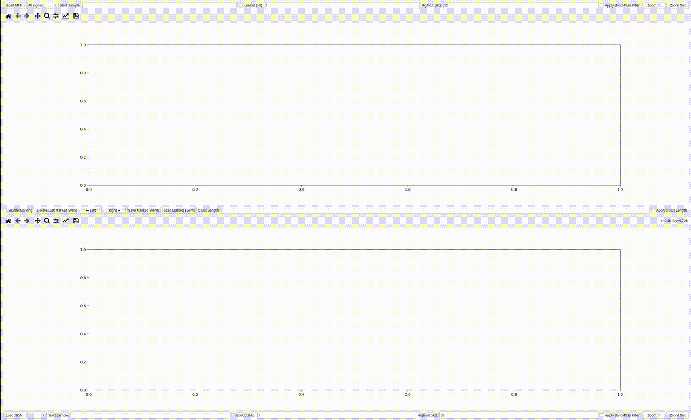
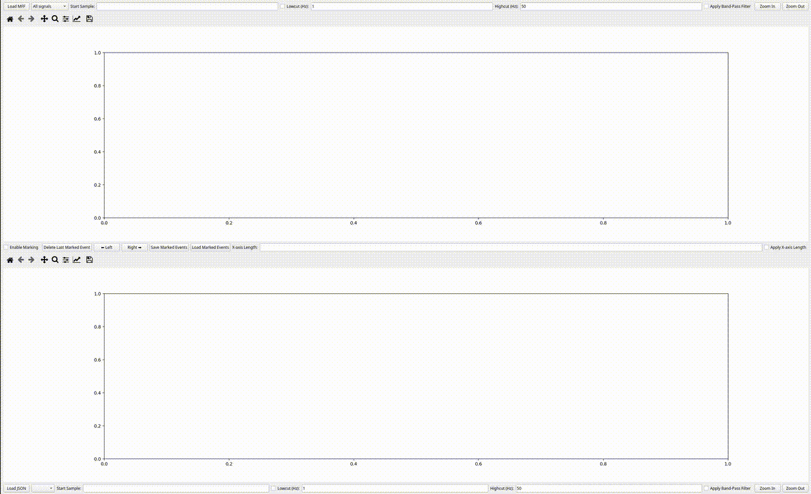
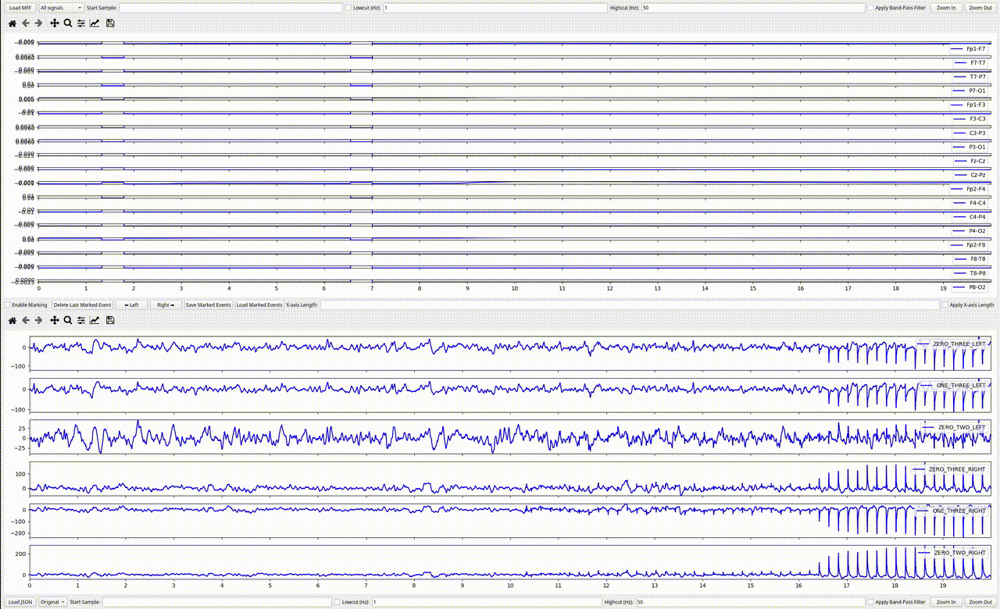
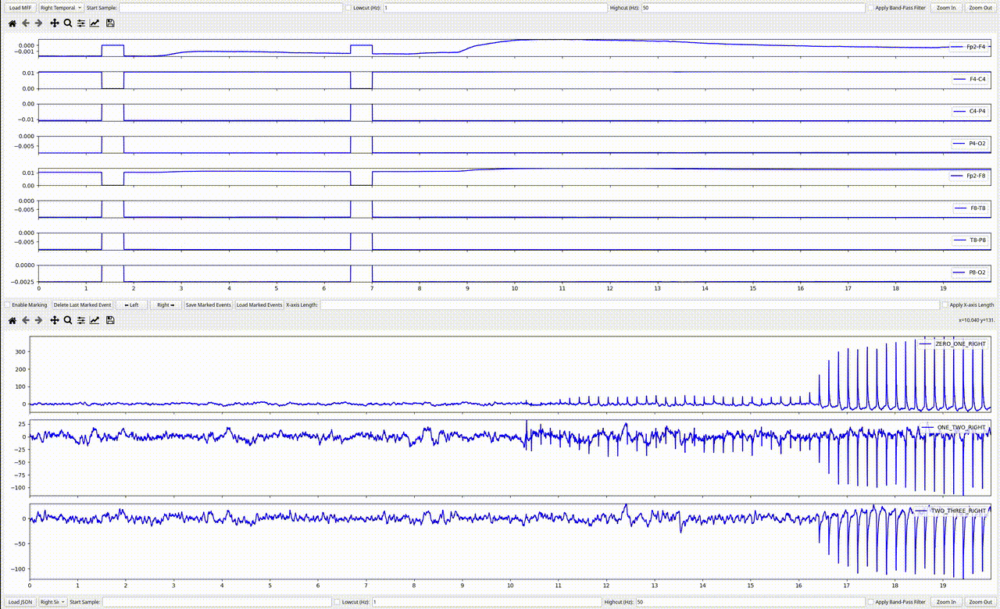
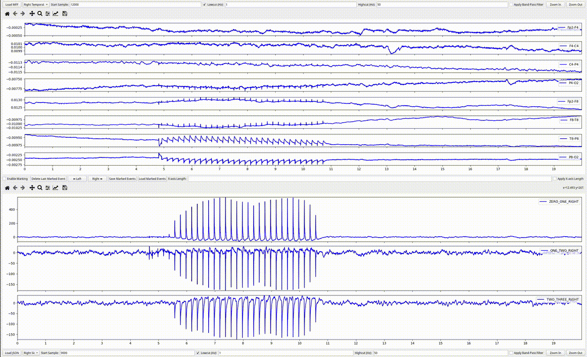
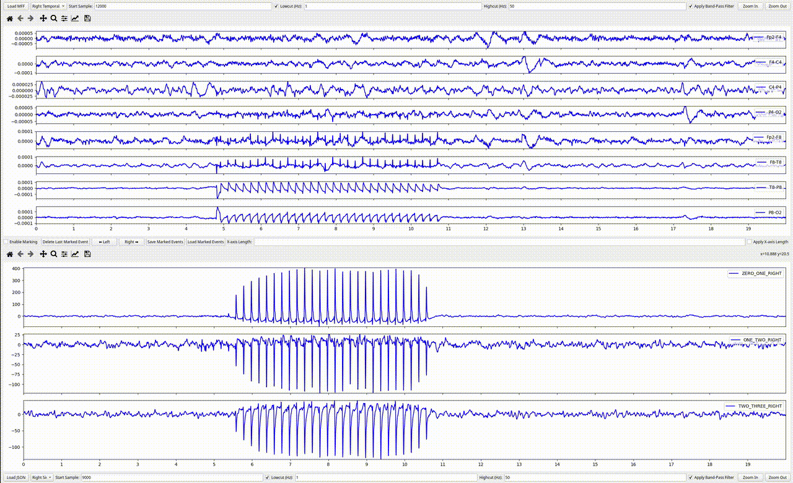
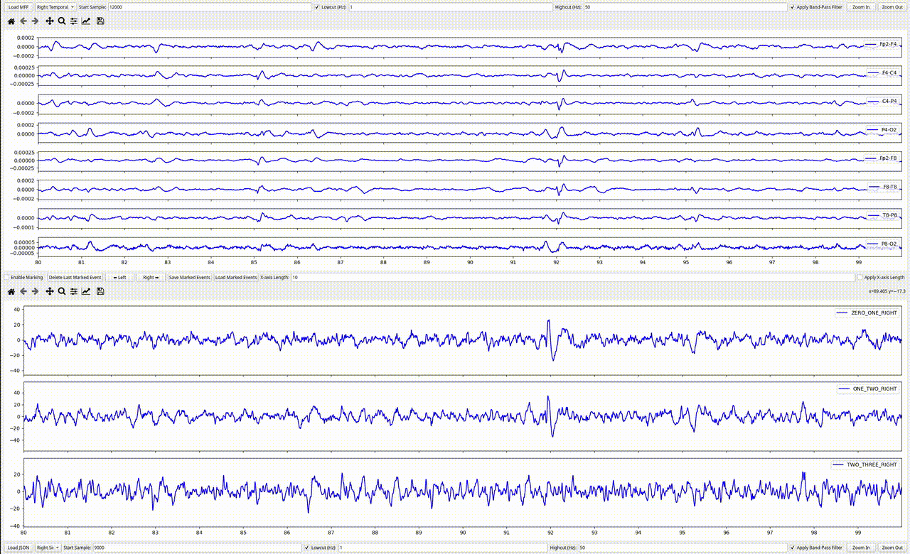
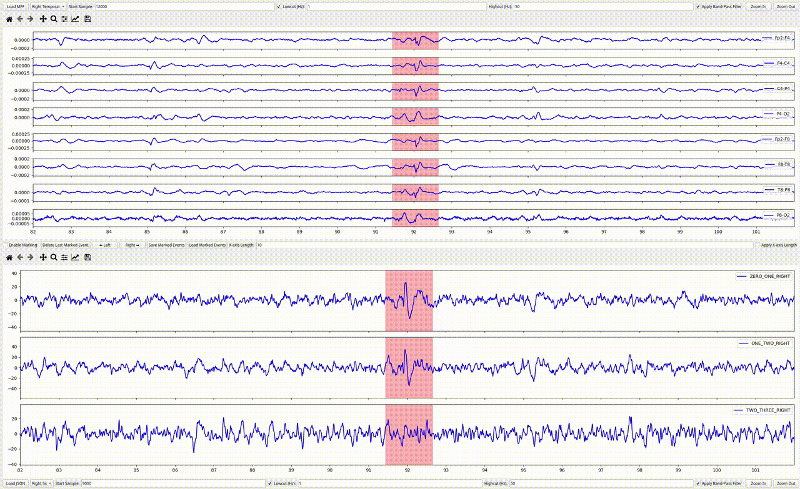
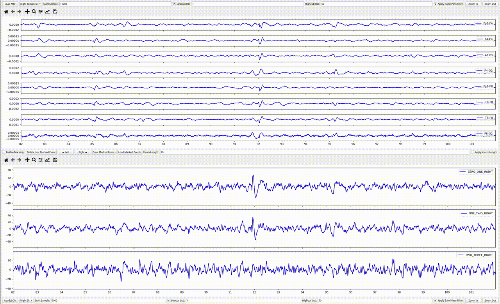

# ClinDBS-Viewer - Interactive EEG & DBS Signal Processing Tool


## Overview  
ClinDBS Viewer is an interactive tool for processing and analyzing EEG and DBS signals.  
Designed for researchers and engineers working on neurological data, this application provides an intuitive interface for event marking, data visualization, and real-time signal analysis.

This project integrates **signal processing techniques**, **machine learning workflows**, and **interactive GUI elements** to assist in understanding neurological patterns.  
It enables efficient preprocessing of EEG and DBS signals, making it easier to extract meaningful insights and develop **data-driven models**.


## Features  

### 1️⃣ Load EEG File  
Load EEG recordings into the application for interactive analysis. This feature allows users to import EEG signals from standard formats and visualize them in real-time.  


### 2️⃣ Load DBS File  
Load DBS (Deep Brain Stimulation) recordings alongside EEG signals. This allows synchronized analysis of brain activity and stimulation responses.  


### 3️⃣ Montage Selection  
Adjust the way EEG and DBS signals are displayed by selecting different montage configurations. This helps in better visualization of specific signal relationships.  


### 4️⃣ Synchronization Cutting  
This feature aligns the EEG and DBS signals based on values computed by a **Transformer model**. The model determines the optimal alignment parameters to ensure the signals are synchronized correctly before further processing.  


### 5️⃣ Signal Filtering  
Apply real-time filters to EEG and DBS signals to remove noise and enhance signal clarity. Users can adjust filter parameters to optimize their analysis.  


### 6️⃣ Pan & Zoom  
Navigate through the signals efficiently using interactive zoom and panning controls. This allows users to focus on specific segments of the signal for detailed inspection.  


### 7️⃣ Marking & Erasing Events  
Manually mark neurological events of interest and remove unwanted annotations. This feature is crucial for segmenting and analyzing relevant portions of the signals.  


### 8️⃣ Save Events  
Save the marked events for later analysis. This ensures that all annotations and observations are stored persistently for future research.  


### 9️⃣ Load Saved Events  
Reload previously saved event annotations into the application. This allows users to continue their analysis without needing to re-mark events manually.  



## Installation
1. Clone this repository:
   ```bash
   git clone https://github.com/RonMon1994/ClinDBS-Viewer.git
   cd ClinDBS-Viewer

2. Install dependencies:
   ```bash
   pip install numpy matplotlib scipy mne pyqt5

3. Run the application:
   ```bash
   python main.py


## 🔒 Code Availability
Due to an upcoming research publication, the source code is currently private. If you are interested in the project, feel free to reach out for further details.


## Contributing

We welcome contributions! To contribute:
1. Fork this repository.
2. Create a new branch (`git checkout -b feature-name`).
3. Commit your changes (`git commit -m "Added new feature"`).
4. Push to the branch (`git push origin feature-name`).
5. Open a Pull Request.


